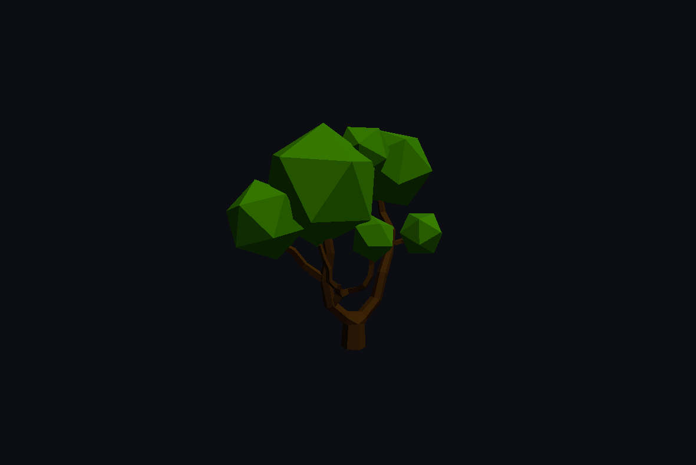
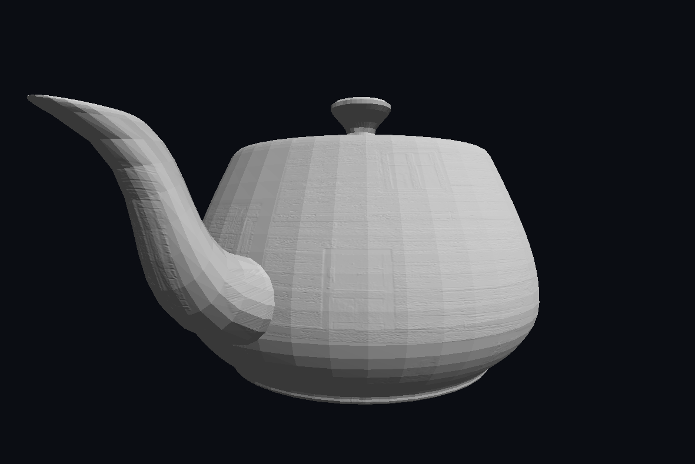
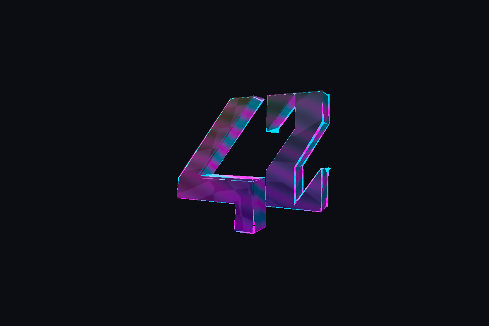
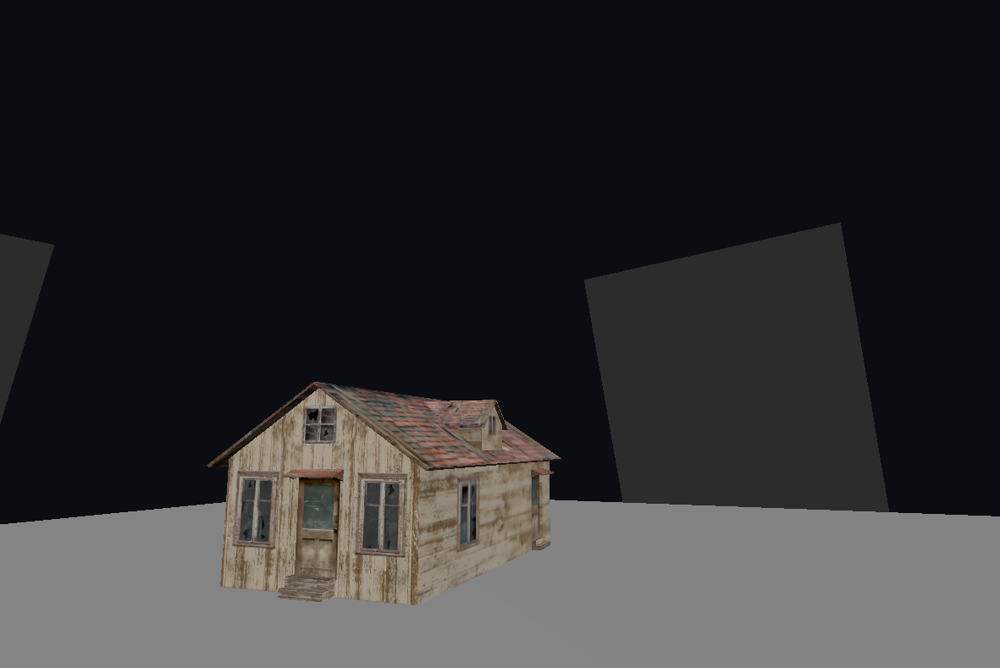

# scop

A dependency-light Rust/OpenGL implementation of the `scop` project.
GLFW is used only for window and event management. OBJ and binary PPM parsing,
matrix math, shader compilation, animation, and rendering are implemented inside
the project.

## Features

- Wavefront OBJ loading with polygon triangulation and negative index support.
- MTL material loading through `mtllib` and `usemtl`.
- Diffuse color support from `Kd` material entries.
- Binary PPM P6 diffuse texture loading from MTL `map_Kd` entries.
- Binary PPM P6 normal map loading from `map_Bump`, `bump`, or normal-map
  material entries.
- Generated spherical UVs for faces without texture coordinates.
- Centered and normalized models, so rotation happens around the object center.
- Tangent-space normal mapping with simple directional lighting.
- Smooth texture blending with the mandatory `T` key transition.
- Toggleable stylized 3D shader effect with neon rim lighting and vertex
  displacement.
- Automatic rotation mode plus free-orbit mode with mouse rotation and scroll
  zoom.

## Screenshots










## Build

Requirements:

- Rust 1.77 or newer
- OpenGL 3.3
- GLFW 3

```sh
make
./scop path/to/model.obj
```

For the included test model:

```sh
make run
```

Other included assets can be opened directly:

```sh
./scop assets/teapot2.obj
./scop assets/cottage_obj.obj
./scop assets/Lowpoly_tree_sample.obj
```

`assets/teapot2.obj` uses `assets/teapot2.mtl`, which assigns the generated
diffuse texture from `assets/texture.ppm` and the PPM normal map from
`assets/cottage_normal.ppm`.

## Controls

| Key | Action |
| --- | --- |
| `T` | Toggle texture with a smooth transition |
| `P` | Toggle stylized hologram shader |
| `F` | Toggle automatic rotation / free orbit |
| `W` / `S` or arrows | Move up / down in free-floating mode |
| `A` / `D` or arrows | Move left / right in free-floating mode |
| `Q` / `E` or Page Up / Page Down | Move forward / backward in free-floating mode |
| Left mouse drag | Rotate in free-orbit mode |
| Scroll wheel | Zoom in / out |
| `R` | Reset rotation and zoom |
| `Esc` | Quit |

The model is normalized and centered from its bounding box before upload, so it
rotates around its center rather than an OBJ-space corner. Faces without texture
coordinates receive generated spherical UV coordinates.
Diffuse and normal textures referenced by OBJ material libraries through
`mtllib`, `usemtl`, MTL `map_Kd`, and normal-map entries such as `map_Bump` are
loaded in binary PPM P6 format. Faces without a mapped material use
`assets/texture.ppm` as the selectable fallback texture.
